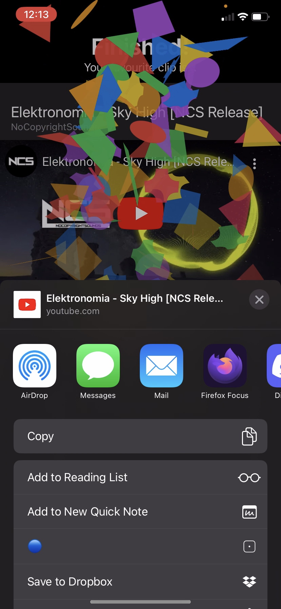

# Clip King - Ryan Morgan

Clip King is a tournament-style mobile quiz app that allows users to find their favourite clips from chosen categories such as music, funny, and vine. Two clips are compared at a time and the selected/preferred category will go through to the next round. This continues until the user has narrowed it down to one clip, of which being their favourite clip. The favourite clip will be presented with a fun confetti animation and would have the option to share it or go back to the list of categories. In landscape mode, clip cards will be resized and stacked horizontally for comfortable viewing.

The app imports and uses the ConfettiSwiftUI package. It should load in automatically with the app, but if it doesn't for any reason this is the Github repository it can be imported from:
https://github.com/simibac/ConfettiSwiftUI

